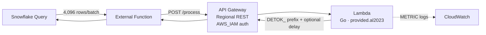
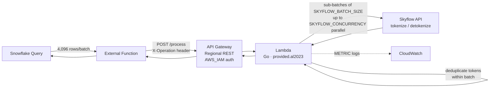
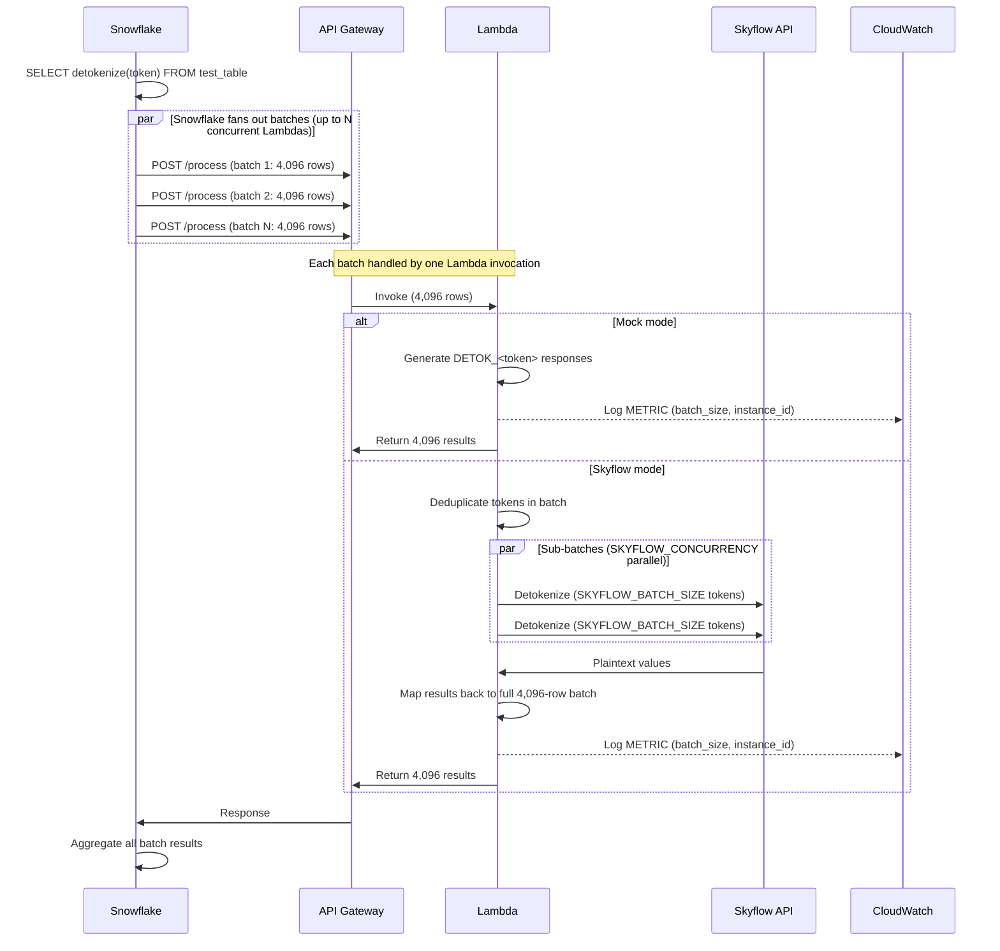

# Snowflake External Function Throughput Benchmark

Measures how Snowflake batches and parallelizes external function calls to determine detokenization throughput ceilings — in both mock mode (simulated latency) and live Skyflow mode.

## What This Measures

- **Batch size**: How many rows does Snowflake send per Lambda invocation? (confirmed: 4,096)
- **Concurrency**: How many Lambdas does Snowflake run in parallel per warehouse size?
- **Throughput**: Raw rows/sec at each warehouse size, table size, and latency profile
- **Warehouse scaling**: Does bigger warehouse = more external function parallelism?
- **Skyflow integration**: End-to-end tokenize/detokenize throughput via Skyflow APIs

## Prerequisites

- **AWS CLI** configured with credentials (`aws sts get-caller-identity`)
- **SnowSQL** configured with a connection (`snowsql -c default -q "SELECT 1"`)
- **Go** 1.21+ (`go version`)
- **jq** (`brew install jq`)

Or run `./run_benchmark.sh --install-prereqs` to install missing tools via Homebrew/pip.

## Configuration

Create `benchmark.conf` in this directory. All credentials and IDs are read from this file — not CLI flags.

```bash
# AWS
AWS_PROFILE="your-aws-profile"
REGION="us-east-2"

# Snowflake
SF_CONNECTION="default"

# Skyflow
SKYFLOW_URL="https://your-vault.skyvault.skyflowapis.com"
SKYFLOW_API_KEY="your-api-key"
SKYFLOW_VAULT_ID="your-vault-id"
SKYFLOW_ACCOUNT_ID="your-account-id"
SKYFLOW_TABLE="table1"
SKYFLOW_COLUMN="name"
SKYFLOW_BATCH_SIZE=25
SKYFLOW_CONCURRENCY=50
```

### Config variables

| Variable | Description |
| -------- | ----------- |
| `AWS_PROFILE` | AWS CLI named profile for deploying Lambda, API Gateway, and IAM resources |
| `REGION` | AWS region for all resources (Lambda, API Gateway, CloudWatch). Must match Snowflake's network path for lowest latency |
| `SF_CONNECTION` | SnowSQL connection name (as defined in `~/.snowsql/config`) |
| `SKYFLOW_URL` | Skyflow Data Plane URL (e.g. `https://<id>.skyvault.skyflowapis.com`). When set and `--mock` is not passed, the Lambda calls Skyflow APIs instead of returning mock data |
| `SKYFLOW_API_KEY` | Skyflow API key (JWT) for authenticating with the Skyflow vault |
| `SKYFLOW_VAULT_ID` | Skyflow vault ID containing the tokenized data |
| `SKYFLOW_ACCOUNT_ID` | Skyflow account ID for API authentication |
| `SKYFLOW_TABLE` | Skyflow vault table name to tokenize/detokenize against |
| `SKYFLOW_COLUMN` | Skyflow vault column name for the token field |
| `SKYFLOW_BATCH_SIZE` | Number of tokens per Skyflow API call. The Lambda batches tokens from each Snowflake batch (4,096 rows) into sub-batches of this size |
| `SKYFLOW_CONCURRENCY` | Max parallel Skyflow API calls per Lambda invocation |
| `CUSTOM_ROWS` | Custom table row count. Equivalent to `--rows N` |
| `CUSTOM_UNIQUE_TOKENS` | Custom unique token count for Skyflow seeding. Equivalent to `--unique-tokens N` |

## Architecture

### Mock mode

When `SKYFLOW_URL` is not set or `--mock` is passed, the Lambda returns `DETOK_<token>` with optional simulated delay (`--delay-ms`). Isolates the Snowflake-to-Lambda pipeline from Skyflow latency.



### Skyflow mode

When `SKYFLOW_URL` is set (and `--mock` is not passed), the Lambda calls Skyflow APIs for real tokenize/detokenize. Each Lambda deduplicates tokens within its batch before calling Skyflow.



### Sequence diagram



## CLI Flags

| Flag | Default | Description |
| ---- | ------- | ----------- |
| `--rows N` | *(none)* | Custom table with N rows (overrides tier table selection) |
| `--unique-tokens N` | *(none)* | Custom unique token count for Skyflow seeding (overrides tier default) |
| `--warehouse SIZE` | *(none)* | Warehouse size: XS, S, M, L, XL, 2XL, 3XL, 4XL (overrides tier) |
| `--mock` | false | Force mock mode (ignore Skyflow config) |
| `--skip-deploy` | false | Reuse existing AWS infra (Lambda, API Gateway) |
| `--skip-setup` | false | Reuse existing Snowflake objects (warehouses, tables, functions) |
| `--cleanup` | false | Tear down all resources and exit |
| `--delay-ms MS` | 0 | Simulated API latency in Lambda (milliseconds) |
| `--iterations N` | 3 | Measured runs per warehouse/table combo |
| `--concurrency N` | 4900 | Lambda reserved concurrency limit |
| `--install-prereqs` | false | Install missing prerequisites via Homebrew/pip |
| `--validate-10b` | false | Append XL/2XL x 10B validation after main matrix |
| `--probe` | false | Pipeline fundamentals (mock-only, CloudWatch concurrency polling) |
| `--quick` | false | Preset: XL x 10M/100M x 3 iters |
| `--medium` | false | Preset: XL x 1M/10M x 2 iters |
| `--micro` | false | Preset: XL x 1K/10K/100K x 1 iter |

## Usage

Use `--rows` and `--unique-tokens` to run at any scale. Deploy once, then iterate with `--skip-deploy` (reuse AWS infra) and `--skip-setup` (reuse Snowflake tables).

```bash
# First run — deploys Lambda, API Gateway, Snowflake objects
./run_benchmark.sh --rows 5000000 --unique-tokens 500000

# Iterate at different scales
./run_benchmark.sh --rows 1000000 --unique-tokens 100000 --skip-deploy --skip-setup
./run_benchmark.sh --rows 50000000 --unique-tokens 5000000 --skip-deploy

# Mock mode — measure pipeline without Skyflow
./run_benchmark.sh --rows 10000000 --mock --skip-deploy --skip-setup

# Mock with simulated latency
./run_benchmark.sh --rows 10000000 --mock --delay-ms 50 --skip-deploy --skip-setup

# Probe pipeline fundamentals (batch size, concurrency)
./run_benchmark.sh --probe --skip-deploy --skip-setup

# Cleanup everything
./run_benchmark.sh --cleanup
```

### Scale reference

| Total Rows | Unique Tokens | Dedup % | Lambda Invocations |
| ---------- | ------------- | ------- | ------------------ |
| 100K | 10K | 90% | ~25 |
| 1M | 100K | 90% | ~244 |
| 5M | 500K | 90% | ~1,221 |
| 10M | 2.5M | 75% | ~2,442 |
| 50M | 5M | 90% | ~12,208 |
| 100M | 25M | 75% | ~24,415 |
| 1B | 100M | 90% | ~244,141 |

Lambda invocations = `ceil(total_rows / 4,096)`. Actual Skyflow API calls per invocation depend on `SKYFLOW_BATCH_SIZE`, `SKYFLOW_CONCURRENCY`, and the dedup ratio within each 4,096-row batch.

## Phases

1. **Preflight checks** — validates AWS, SnowSQL, Go, jq
2. **AWS deployment** — builds Lambda, creates API Gateway, configures IAM (skipped with `--skip-deploy`)
3. **Snowflake setup** — creates warehouses, tables, seeds token data, creates external functions (skipped with `--skip-setup`)
4. **Benchmarks** — runs the test matrix with warmup + measured iterations
5. **Results** — pipeline analysis table, CloudWatch metrics, stored in `EXT_FUNC_BENCHMARK.BENCHMARK.benchmark_results`
