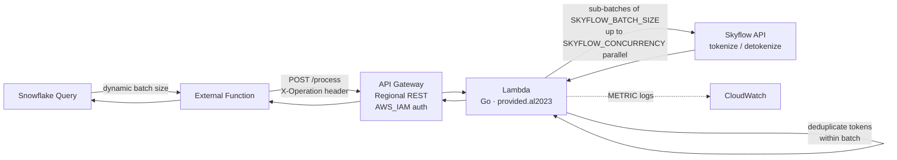
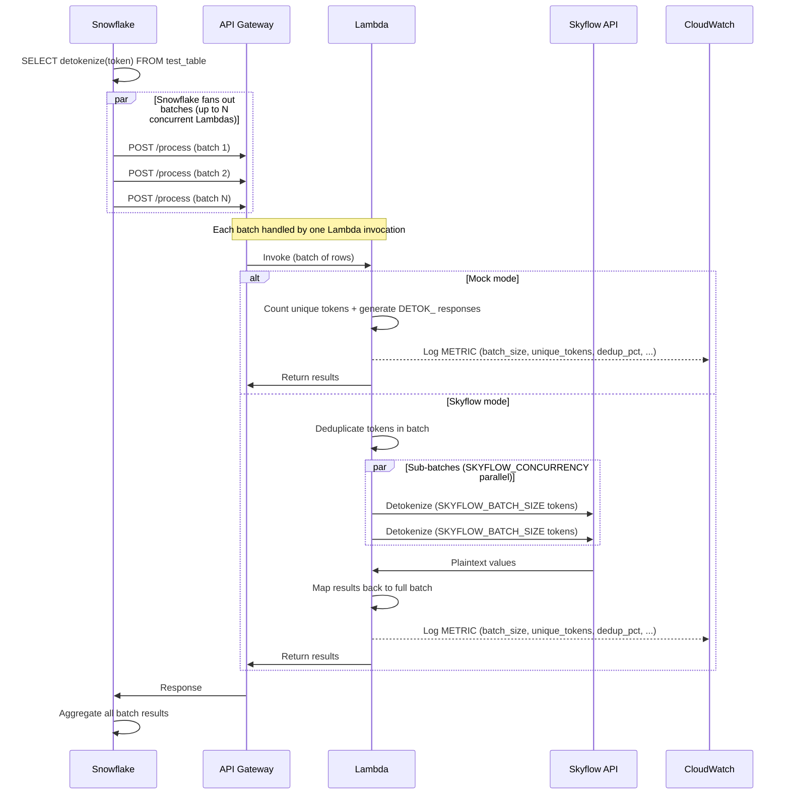

# Snowflake External Function Throughput Benchmark

Measures how Snowflake batches and parallelizes external function calls to determine detokenization throughput ceilings — in both mock mode (simulated latency) and live Skyflow mode.

## What This Measures

- **Batch size**: How many rows does Snowflake send per Lambda invocation? (dynamic: ~190 at 0ms latency, up to ~4,096 at high latency)
- **Concurrency**: How many Lambdas does Snowflake run in parallel per warehouse size?
- **Throughput**: Raw rows/sec at each warehouse size, table size, and latency profile
- **Warehouse scaling**: Does bigger warehouse = more external function parallelism?
- **Skyflow integration**: End-to-end tokenize/detokenize throughput via Skyflow APIs

## Prerequisites

- **AWS CLI** configured with credentials (`aws sts get-caller-identity`)
- **SnowSQL** configured with a connection (`snowsql -c default -q "SELECT 1"`)
- **Go** 1.21+ (`go version`)
- **jq** (`brew install jq`)

Or run `./run_benchmark.sh --install-prereqs` to install missing tools via Homebrew/pip.

## Configuration

Create `benchmark.conf` in this directory. All credentials and IDs are read from this file — not CLI flags.

```bash
# AWS
AWS_PROFILE="your-aws-profile"
REGION="us-east-2"

# Snowflake
SF_CONNECTION="default"

# Skyflow
SKYFLOW_URL="https://your-vault.skyvault.skyflowapis.com"
SKYFLOW_API_KEY="your-api-key"
SKYFLOW_VAULT_ID="your-vault-id"
SKYFLOW_ACCOUNT_ID="your-account-id"
SKYFLOW_TABLE="table1"
SKYFLOW_COLUMN="name"
SKYFLOW_BATCH_SIZE=25
SKYFLOW_CONCURRENCY=50
```

### Config variables

| Variable | Description |
| -------- | ----------- |
| `AWS_PROFILE` | AWS CLI named profile for deploying Lambda, API Gateway, and IAM resources |
| `REGION` | AWS region for all resources (Lambda, API Gateway, CloudWatch). Must match Snowflake's network path for lowest latency |
| `SF_CONNECTION` | SnowSQL connection name (as defined in `~/.snowsql/config`) |
| `SKYFLOW_URL` | Skyflow Data Plane URL (e.g. `https://<id>.skyvault.skyflowapis.com`). When set and `--mock` is not passed, the Lambda calls Skyflow APIs instead of returning mock data |
| `SKYFLOW_API_KEY` | Skyflow API key (JWT) for authenticating with the Skyflow vault |
| `SKYFLOW_VAULT_ID` | Skyflow vault ID containing the tokenized data |
| `SKYFLOW_ACCOUNT_ID` | Skyflow account ID for API authentication |
| `SKYFLOW_TABLE` | Skyflow vault table name to tokenize/detokenize against |
| `SKYFLOW_COLUMN` | Skyflow vault column name for the token field |
| `SKYFLOW_BATCH_SIZE` | Number of tokens per Skyflow API call. The Lambda batches tokens from each Snowflake batch into sub-batches of this size |
| `SKYFLOW_CONCURRENCY` | Max parallel Skyflow API calls per Lambda invocation |

## Quick Start

```bash
# 1. First run — deploys all infra, creates table, runs benchmark
./run_benchmark.sh --rows 5000000 --unique-tokens 500000 --warehouse XL --iterations 2

# 2. Re-run at a different scale (redeploy Lambda, recreate table)
./run_benchmark.sh --rows 10000000 --unique-tokens 1000000 --warehouse XL --iterations 3 --skip-deploy

# 3. Mock mode — pipeline only, no Skyflow
./run_benchmark.sh --rows 10000000 --mock --warehouse XL --skip-deploy

# 4. Cleanup
./run_benchmark.sh --cleanup
```

## Architecture

### Mock mode

When `SKYFLOW_URL` is not set or `--mock` is passed, the Lambda returns `DETOK_<token>` with optional simulated delay (`--delay-ms`). Isolates the Snowflake-to-Lambda pipeline from Skyflow latency.


### Skyflow mode

When `SKYFLOW_URL` is set (and `--mock` is not passed), the Lambda calls Skyflow APIs for real tokenize/detokenize. Each Lambda deduplicates tokens within its batch before calling Skyflow.



### Sequence diagram



## Token Distribution

In Skyflow mode, the benchmark seeds N unique tokens (`--unique-tokens`) across M rows (`--rows`). Each row is assigned a token using a **Zipf (s=1) distribution** — not uniform — to simulate real-world data where a small fraction of tokens (popular customers, frequent products) appear in the majority of rows. Both mock and Skyflow modes track dedup stats per batch.

### How it works

```sql
-- Each row maps to a seed token via:
seed_id = FLOOR(POW(SEED_COUNT, HASH(row_id) / MAX_HASH)) - 1
```

`POW(N, uniform)` produces a true Zipf distribution where `P(token k) ∝ 1/k`. The most popular token gets ~3-4% of all rows; the least popular gets a handful.

### Why this matters

Snowflake sends batches of rows to each Lambda invocation (batch size varies dynamically — see [What This Measures](#what-this-measures)). The Lambda deduplicates tokens within each batch before calling Skyflow — so batch dedup directly determines how many Skyflow API calls are needed.

With uniform distribution (`MOD`), every token appears at most once per batch — zero dedup. With Zipf, popular tokens repeat within batches, giving realistic dedup that scales with the token count:

| Unique Tokens | Avg Unique / Batch (1K rows) | Avg Dedup % |
|---|---|---|
| 1K | ~315 | ~68% |
| 10K | ~535 | ~47% |
| 100K | ~700 | ~30% |
| 500M | ~825 | ~18% |

### End-of-run analysis

Phase 5 fetches Lambda METRIC logs from CloudWatch and displays the actual dedup stats observed during the benchmark:

```
Batch Token Dedup Analysis (from 245 METRIC log lines):
  Avg batch size:         1000.0
  Avg unique tokens:      535.2
  Avg repeated tokens:    464.8
  Avg dedup %:            46.5%
```

## CLI Flags

| Flag | Default | Description |
| ---- | ------- | ----------- |
| `--rows N` | *(none)* | Custom table with N rows (overrides tier table selection) |
| `--unique-tokens N` | *(none)* | Custom unique token count for Skyflow seeding (overrides tier default) |
| `--warehouse SIZE` | *(none)* | Warehouse size: XS, S, M, L, XL, 2XL, 3XL, 4XL (overrides tier) |
| `--mock` | false | Force mock mode (ignore Skyflow config) |
| `--skip-deploy` | false | Reuse existing AWS infra (Lambda, API Gateway) |
| `--skip-setup` | false | Reuse existing Snowflake objects (warehouses, tables, functions) |
| `--cleanup` | false | Tear down all resources and exit |
| `--delay-ms MS` | 0 | Simulated API latency in Lambda (milliseconds) |
| `--iterations N` | 3 | Measured runs per warehouse/table combo |
| `--concurrency N` | 4900 | Lambda reserved concurrency limit |
| `--install-prereqs` | false | Install missing prerequisites via Homebrew/pip |
| `--validate-10b` | false | Append XL/2XL x 10B validation after main matrix |
| `--probe` | false | Pipeline fundamentals (mock-only, CloudWatch concurrency polling) |
| `--quick` | false | Preset: XL x 10M/100M x 3 iters |
| `--medium` | false | Preset: XL x 1M/10M x 2 iters |
| `--micro` | false | Preset: XL x 1K/10K/100K x 1 iter |

## Usage

Use `--rows` and `--unique-tokens` to run at any scale. Deploy once, then iterate with `--skip-deploy` (reuse AWS infra). Use `--skip-setup` to reuse existing Snowflake tables (note: `--rows` has no effect with `--skip-setup` since the table isn't recreated).

```bash
# Mock with simulated latency
./run_benchmark.sh --rows 10000000 --mock --delay-ms 50 --skip-deploy

# Probe pipeline fundamentals (batch size, concurrency)
./run_benchmark.sh --probe --skip-deploy --skip-setup
```

### Scale reference

| Total Rows | Unique Tokens | Batch Dedup % | Lambda Invocations |
| ---------- | ------------- | ------------- | ------------------ |
| 100K | 10K | ~47% | ~100 |
| 1M | 100K | ~30% | ~1,000 |
| 10M | 1M | ~22% | ~10,000 |
| 100M | 10M | ~19% | ~100,000 |
| 1B | 100M | ~18% | ~1,000,000 |

Lambda invocations ≈ `total_rows / batch_size`. Snowflake dynamically sizes batches (~190 rows at 0ms latency, up to ~4,096 at high latency) — invocation counts above assume ~1,000 rows/batch at low latency. Batch dedup % follows the Zipf distribution — see [Token Distribution](#token-distribution). Actual Skyflow API calls per invocation depend on `SKYFLOW_BATCH_SIZE`, `SKYFLOW_CONCURRENCY`, and the dedup ratio.

## Phases

1. **Preflight checks** — validates AWS, SnowSQL, Go, jq
2. **AWS deployment** — builds Lambda, creates API Gateway, configures IAM (skipped with `--skip-deploy`)
3. **Snowflake setup** — creates warehouses, tables, seeds token data, creates external functions (skipped with `--skip-setup`)
4. **Benchmarks** — runs the test matrix with warmup + measured iterations
5. **Results** — pipeline analysis table, CloudWatch metrics, stored in `EXT_FUNC_BENCHMARK.BENCHMARK.benchmark_results`
